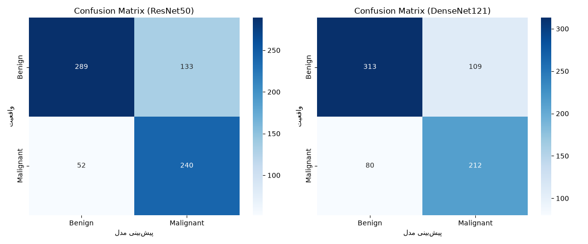
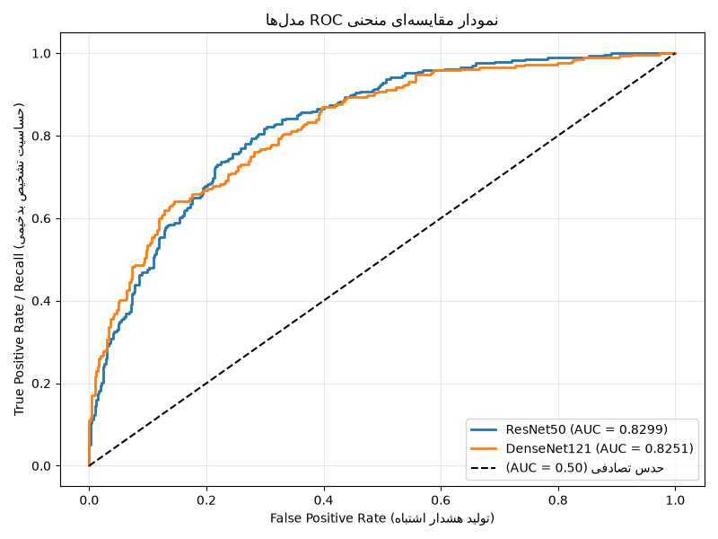

# 🎗️ Breast Cancer Classification using Deep Learning (CBIS-DDSM)


A comprehensive Deep Learning pipeline for classifying breast cancer mammography images from the **CBIS-DDSM** dataset using **ResNet-50** and **DenseNet-121** architectures implemented in PyTorch.

---

## 📌 Table of Contents
- [Overview](#-overview)
- [Key Features](#-key-features)
- [Project Structure](#-project-structure)
- [Dataset](#-dataset)
- [Installation & Setup](#-installation--setup)
- [Usage](#-usage)
  - [1. Data Preprocessing](#1-data-preprocessing)
  - [2. Model Training](#2-model-training)
  - [3. Evaluation](#3-evaluation)
  - [4. Inference & Prediction](#4-inference--prediction)
- [Results & Model Comparison](#-results--model-comparison)
- [Visualizations](#-visualizations)

---

## 🔬 Overview
Breast cancer early detection via digital mammography substantially improves clinical outcomes. This repository contains an end-to-end computer vision framework that:
1. Processes DICOM/Mammography ROI images from the CBIS-DDSM dataset.
2. Constructs a balanced, standardized CSV dataset.
3. Fine-tunes deep convolutional networks (**ResNet-50** & **DenseNet-121**) using transfer learning.
4. Evaluates models using ROC-AUC, Confusion Matrix, Sensitivity/Recall, Precision, and F1-Score.

---

## ✨ Key Features
- **Fast Package Management**: Managed with [`uv`](https://github.com/astral-sh/uv) for lightning-fast dependency resolution and deterministic builds.
- **Deep Transfer Learning**: Pre-trained ResNet-50 and DenseNet-121 architectures customized for binary/multiclass mammogram classification.
- **Data Preprocessing & Augmentation**: Advanced ROI extraction, normalization, and resizing tailored for medical image analysis.
- **Comprehensive Evaluation**: Automated scripts for generating confusion matrices, ROC curves, and performance metric tables.

---

## 📁 Project Structure

```text
BreastCancer/
├── CBIS-DDSM/                   # Raw dataset (ignored by git)
├── CBIS-DDSM_processed/         # Preprocessed image directory (ignored by git)
├── PreProcess.py                # Image preprocessing & normalization routines
├── Dataset Creator.py           # Dataset compilation & CSV generator
├── final_dataset.csv            # Structured dataset metadata
├── train.py                     # Training script for ResNet-50
├── train_densenet.py            # Training script for DenseNet-121
├── evaluate.py                  # Model evaluation & metrics generation
├── predict.py                   # Single image inference script
├── test.py                      # Quick testing / validation utility
├── models_confusion_matrices.png # Confusion matrix plots
├── models_roc_comparison.png    # ROC curves comparison plot
├── pyproject.toml               # Project dependencies and configs
├── uv.lock                      # Locked dependency graph
└── README.md                    # Project documentation
```

---

## 📊 Dataset
The project utilizes the **CBIS-DDSM (Curated Breast Imaging Subset of DDSM)** dataset.
- **Source**: [TCIA CBIS-DDSM Collection](https://wiki.cancerimagingarchive.net/display/Public/CBIS-DDSM)
- **Content**: Mammography exams including calcification and mass cases with pixel-level ROI annotations and clinical ground truth (Benign / Malignant).

> **Note**: Due to size constraints, the raw dataset and trained weight checkpoints (`.pth` files) are excluded from the repository.

---

## ⚙️ Installation & Setup

This project uses **`uv`** for Python environment management.

### Prerequisites
- Python 3.10+
- [`uv`](https://docs.astral.sh/uv/) installed on your machine.

### 1. Clone the repository
```bash
git clone [https://github.com/YOUR_USERNAME/YOUR_REPOSITORY.git](https://github.com/YOUR_USERNAME/YOUR_REPOSITORY.git)
cd YOUR_REPOSITORY
```

### 2. Create virtual environment and install dependencies
```bash
uv sync
```

---

## 🚀 Usage

### 1. Data Preprocessing
Run the preprocessing script to clean and normalize mammogram images:
```bash
uv run python PreProcess.py
uv run python "Dataset Creator.py"
```

### 2. Model Training
To train the **ResNet-50** model:
```bash
uv run python train.py
```

To train the **DenseNet-121** model:
```bash
uv run python train_densenet.py
```

### 3. Evaluation
Generate performance metrics, ROC curves, and confusion matrices:
```bash
uv run python evaluate.py
```

### 4. Inference & Prediction
Run prediction on a new image:
```bash
uv run python predict.py --image_path "path/to/mammogram.jpg"
```

---

## 📈 Results & Model Comparison

| Architecture | Accuracy | Precision | Recall / Sensitivity | F1-Score | AUC-ROC |
| :--- | :---: | :---: | :---: | :---: | :---: |
| **ResNet-50** | *--%* | *--%* | *--%* | *--%* | *0.--* |
| **DenseNet-121** | *--%* | *--%* | *--%* | *--%* | *0.--* |

*(Replace `--%` with your actual evaluation results from `evaluate.py`)*

---

## 🖼️ Visualizations

### Confusion Matrices


### ROC Curves Comparison


---

## 📜 License
Distributed under the **MIT License**. See `LICENSE` for more information.
